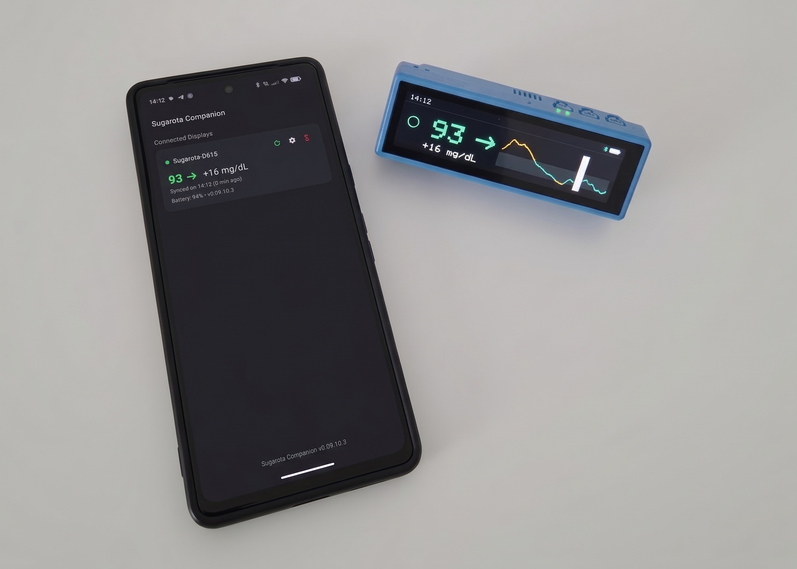

# 🍭 Sugarota: A Pocket-Size Smart Glucose Monitor Firmware and Android App

Sugarota is a wireless blood glucose display and telemetry terminal powered by the ESP32-S3 chipset. It syncs real-time CGM data from Dexcom Share or Nightscout APIs, plots high-DPI historical trend graphs on the screen, and features a browser-based WebSerial interface to flash firmware and manage device settings. The Android companion app bridges the gap between the display and your phone, providing seamless data management and synchronization through energy-efficient BLE connectivity.



Initially built for Waveshare ESP32-S3-Touch-LCD-3.49 Development platform. 

See [CHANGELOG](CHANGELOG.md) for latest builds updates.

---

## ⚡ Quickstart

### Installation via GitHub Pages (EASIEST)

1. Buy the Waveshare ESP32-S3-Touch-LCD-3.49 on manufacturer's website or AliExpress.
2. Go to the installation page: https://not-really-a-coder.github.io/sugarota/installer.html
3. Connect the device to your computer using USB-C cable, click "Connect USB device", and select the port.
4. The installer will automatically detect a blank device and prepare a **Full Install**. Click "Start Flashing Firmware".

All entered credentials and settings are saved ONLY on the device. Nothing is being saved or stored on the local or remote host by the author of this software.

### Initial configuration

After flashing the firmware, configure your Wi-Fi credentials and CGM provider settings using any of the following options:

1. **Via Web-Installer (The Easiest)**:
   Immediately after flashing (or anytime you connect via USB-C), configure your primary and backup Wi-Fi networks, CGM provider (Dexcom Share or Nightscout), and unit preferences directly from the web installer interface.
2. **Via Android App**:
   Compile or download and install the companion app directly: [sugarota-app-debug.apk](android-app/sugarota-app-debug.apk). Once paired over Bluetooth Low Energy (BLE), the app seamlessly synchronizes device settings, Wi-Fi configuration, and bridges real-time CGM data directly from your phone.
3. **Via Shaking and accessing `http://sugarota.local`**:
   Shake the device vigorously at any time to enter wireless **Config Mode**. Scan the displayed QR code with your smartphone camera or navigate to [http://sugarota.local](http://sugarota.local) (especially convenient for Apple / iOS and macOS users) while connected to the same local Wi-Fi network.

### Local installation

The local setup center requires **zero external python packages** (no `requirements.txt` needed!)—it runs fully using standard library modules included with Python.

1.  **Launch the Setup Server**:
    Run the multi-threaded host script from the repository root:
    ```bash
    python utils/run_web_installer.py
    ```
2.  **Access the Dashboard**:
    Open your browser to: **[http://localhost:8123/installer.html](http://localhost:8123/installer.html)**
3.  **Flash & Configure**:
    *   Connect your ESP32-S3 screen via USB-C.
    *   The installer will auto-detect a new device and select **Full Install**. Click **Start Flashing Firmware**.
    *   Configure settings directly via the web dashboard or shake the device into Config Mode.

---

## ✨ Key Features & Hardware Specs

- **Long Battery Autonomy**: Up to **18 hours of autonomous operation** without recharging on a single battery charge when using Bluetooth Low Energy (BLE) connection with the companion app.
- **Dual Hardware Compatibility**: Automatically detects and drives both Waveshare ESP32-S3-Touch-LCD-3.49 Hardware V1 and V2 (Rev1.1) revisions with dynamic backlight boost control.
- **Real-Time CGM Monitoring**: Native support for Dexcom Share and Nightscout REST APIs with delta display and direction trend arrows.
- **Smart Timestamp-Aligned Fetching**: Subsequent data polls align precisely to your CGM reading timestamps, minimizing radio airtime and stale fetches.
- **Display & Touch Controls**:
  - **Double-Press (PWR Button)**: Instantly toggles display and touchscreen ON/OFF while preserving current brightness level.
  - **Single-Press (PWR Button)**: Cycles through active brightness levels (`76 -> 153 -> 204 -> 255`) without turning off, or wakes the screen if off. Also operates during boot sequences.
  - **Long-Press (PWR Button)**: Cleanly powers down the device (supported during normal operation and boot).
  - **Theme Toggle (BOOT Button)**: Switches between high-contrast pixelated dark console and soft flashlight light theme.
  - **Unit Configuration**: Configurable via Web Installer or Android Companion App settings.
- **Companion App Remote Control & Find Device**: Control brightness, toggle dark/light theme, trigger acoustic Find Device locator alarm with loud distinct beeps, or remotely reboot and power off the device directly over BLE.
- **High-DPI Interactive Historical Chart**: 4-hour historical CGM graph with touch scrubber for inspecting past readings.
- **Orientation & Gesture Sensing**: QMI8658 6-axis IMU enables shake-to-refresh, face-down auto-sleep gesture, and automatic 180° rotation into injection-to-meal stopwatch timer mode.
- **Privacy & Security**: Link-encrypted BLE pairing with numeric passkey verification; credentials are saved purely on-device in encrypted LittleFS flash with zero cloud reliance.

---

## 📚 Documentation & Technical Specifications

Detailed technical documentation, data models, and specifications are organized in the [`docs/`](docs/) directory:
* [System Architecture & State Flow](docs/architecture.md)
* [Design System & Color Palette](docs/design_system.md)
* [BLE GATT Protocol Specification](docs/ble_gatt_spec.md)
* [Data Schemas & Telemetry Formats](docs/data_schemas.md)
* [Hardware Guide & Pinout Reference](docs/hardware_guide.md)
* [Build & Toolchain Requirements](docs/build_requirements.md)

---

## 🛠️ Arduino Compilation Requirements

If you want to modify or compile the C++ firmware directly from source, refer to the [Build Requirements Guide](docs/build_requirements.md). The main sketch and modules are located under [`firmware/sugarota/`](firmware/sugarota/).

To compile from command line via Arduino CLI:
```powershell
.\utils\firmware_build.ps1
```

Refer to the [Manufacturer's GitHub Repository](https://github.com/waveshareteam/ESP32-S3-Touch-LCD-3.49/) and [device technical documentation](https://docs.waveshare.com/ESP32-S3-Touch-LCD-3.49?variant=ESP32-S3-Touch-LCD-3.49-EN) for more details.

---

## 📱 Android Companion App

The Android Companion App provides direct Bluetooth Low Energy (BLE) background bridging, syncing glucose telemetry and history packets from Dexcom Share or Nightscout directly to the Sugarota display without requiring the device to wake its Wi-Fi radio.

Download the pre-built APK directly from the repository:
- **[sugarota-app-debug.apk](android-app/sugarota-app-debug.apk)**

To build, install, and run the Android companion app directly on a connected device (over USB or Wireless ADB):
```powershell
.\utils\run_android_app.ps1
```
* `.\utils\run_android_app.ps1 -Install`: Build debug APK and install to connected device only.
* `.\utils\run_android_app.ps1 -Launch`: Launch the companion app without rebuilding.
* `.\utils\run_android_app.ps1 -Logs`: Stream filtered real-time Logcat output (`SugarotaBleService`, `MainActivity`).

See [Build & Toolchain Requirements](docs/build_requirements.md) for zero-setup environment details.

---

## 🔒 Security & Local Settings

**No data is shared or sent anywhere. Only you and your provider has access to it.**

Your local configuration containing passwords and API keys is protected by design:
*   **`data/config.template.json`**: Standard configuration template containing generic placeholders for Wi-Fi and API servers.
*   **`data/config.json`**: Your active credentials file that will be created after your first run. When you start `utils/run_web_installer.py`, the server automatically creates this file from the template if it is missing. Make sure that file creation permissions are enabled in the **`data/`** folder. 